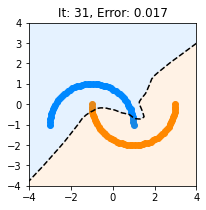

# Training a Neural Network

In this homework, our objective is to implement a simple neural network from scratch, in particular, error backpropagation and the gradient descent optimization procedure. We first import some useful libraries.


```python
import numpy
import matplotlib
%matplotlib inline
from matplotlib import pyplot as plt
na = numpy.newaxis
numpy.random.seed(0)
```

We consider a two-dimensional moon dataset on which to train the network. We also create a grid dataset which we will use to visualize the decision function in two dimensions. We denote our two inputs as $x_1$ and $x_2$ and use the suffix `d` and `g` to designate the actual dataset and the grid dataset.


```python
# Create a moon dataset on which to train the neural network
import sklearn,sklearn.datasets
Xd,Td = sklearn.datasets.make_moons(n_samples=100)
Xd = Xd*2-1
Td = Td * 2 - 1
X1d = Xd[:,0]
X2d = Xd[:,1]

# Creates a grid dataset on which to inspect the decision function
l = numpy.linspace(-4,4,100)
X1g,X2g = numpy.meshgrid(l,l)
```


```python
print(X1g.shape, X2g.shape)
```

    (100, 100) (100, 100)
    

The moon dataset is plotted below along with some dummy decision function $x_1+x_2=0$.


```python
def plot(Yg,title=None):
    plt.figure(figsize=(3,3))
    plt.scatter(*Xd[Td==-1].T,color='#0088FF')
    plt.scatter(*Xd[Td==1].T,color='#FF8800')
    plt.contour(X1g,X2g,Yg,levels=[0],colors='black',linestyles='dashed')
    plt.contourf(X1g,X2g,Yg,levels=[-100,0,100],colors=['#0088FF','#FF8800'],alpha=0.1)
    if title is not None: plt.title(title)
    plt.show()
    
plot(X1g+X2g) # plot the dummy decision function
```


    

    


## Part 1: Implementing Error Backpropagation (30 P)

We would like to implement the neural network with the equations:
\begin{align*}
\forall_{j=1}^{25}:~ z_j &= x_1 w_{1j} + x_2 w_{2j} + b_j\\
\forall_{j=1}^{25}:~a_j &= \max(0,z_j)\\
y &= \sum_{j=1}^{25} a_j v_j
\end{align*}
where $x_1,x_2$ are the two input variables and $y$ is the output of the network. The parameters of the neural network are initialized randomly using the normal distributions $w_{ij} \sim \mathcal{N}(\mu=0,\sigma^2=1/2)$, $b_{j} \sim \mathcal{N}(\mu=0,\sigma^2=1)$, $v_{j} \sim \mathcal{N}(\mu=0,\sigma^2=1/25)$. The following code initializes the parameters of the network and implements the forward pass defined above. The neural network is composed of 50 neurons.


```python
import numpy

NH = 50

W = numpy.random.normal(0,1/2.0**.5,[2,NH])
B = numpy.random.normal(0,1,[NH])
V = numpy.random.normal(0,1/NH**.5,[NH])

def forward(X1,X2):
    X = numpy.array([X1.flatten(),X2.flatten()]).T # Convert meshgrid into dataset
    Z = X.dot(W)+B
    A = numpy.maximum(0,Z)
    Y = A.dot(V)
    return Y.reshape(X1.shape) # Reshape output into meshgrid
```


```python
print(W.shape, B.shape, V.shape)
```

    (2, 50) (50,) (50,)
    

We now consider the task of training the neural network to classify the data. For this, we define the error function:
$$
\mathcal{E}(\theta) = \sum_{k=1}^N \max(0,-y^{(k)} t^{(k)})
$$
where $N$ is the number of data points, $y$ is the output of the network and $t$ is the label.

**Task:**

 * **Complete the function below so that it returns the gradient of the error w.r.t. the parameters of the model.**


```python
import numpy as np

def backprop(X1,X2,T):
    X = numpy.array([X1.flatten(),X2.flatten()]).T

    # Compute activations
    Z = X.dot(W)+B
    A = numpy.maximum(0,Z)
    Y = A.dot(V)
    
    # Compute backward pass
    DY = (-Y*T>0)*(-T)
    DZ = numpy.outer(DY,V)*(Z>0)
    
    # Compute parameter gradients (averaged over the whole dataset)
    
    DV = DY.T @ A
    DB = DZ.T @ np.ones(100, )
    DW = X.T @ DZ
    
    return DW,DB,DV
```

## Exercise 2: Training with Gradient Descent (20 P)

We would like to use error backpropagation to optimize the parameters of the neural network. The code below optimizes the network for $128$ iterations and at some chosen iterations plots the decision function along with the current error.

**Task:**
 * **Complete the procedure above to perform at each iteration a step along the gradient in the parameter space. A good choice of learning rate is $\eta=0.1$.**


```python
lr = 0.1
for i in range(128):    
    if i in [0,1,3,7,15,31,63,127]:
        Yg = forward(X1g,X2g)
        Yd = forward(X1d,X2d)
        Ed = numpy.maximum(0,-Yd*Td).mean()
        plot(Yg,title="It: %d, Error: %.3f"%(i,Ed))
        DW,DB,DV = backprop(X1d, X2d, Td)
        W -= lr * DW
        B -= lr * DB
```


    

    


    

    


    

    


    

    


    

    


    

    


    

    


    

    

